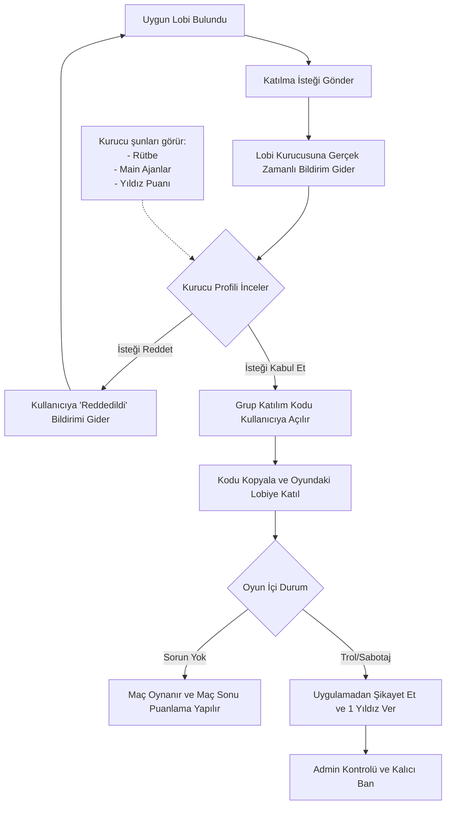

```mermaid
graph TD
    A[Uygun Lobi Bulundu] --> B[Katılma İsteği Gönder]
    B --> C[Lobi Kurucusuna Gerçek Zamanlı Bildirim Gider]
    
    C --> D{Kurucu Profili İnceler}
    note1[Kurucu şunları görür:<br>- Rütbe<br>- Main Ajanlar<br>- Yıldız Puanı] -.-> D
    
    D -- İsteği Reddet --> E[Kullanıcıya 'Reddedildi' Bildirimi Gider]
    E --> A
    
    D -- İsteği Kabul Et --> F[Grup Katılım Kodu Kullanıcıya Açılır]
    F --> G[Kodu Kopyala ve Oyundaki Lobiye Katıl]
    
    G --> H{Oyun İçi Durum}
    H -- Sorun Yok --> I[Maç Oynanır ve Maç Sonu Puanlama Yapılır]
    H -- Trol/Sabotaj --> J[Uygulamadan Şikayet Et ve 1 Yıldız Ver]
    
    J --> K[Admin Kontrolü ve Kalıcı Ban]
```
