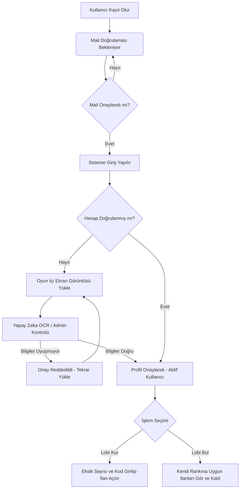

```mermaid
graph TD
    A[Kullanıcı Kayıt Olur] --> B(Mail Doğrulaması Bekleniyor)
    B --> C{Mail Onaylandı mı?}
    C -- Hayır --> B
    C -- Evet --> D[Sisteme Giriş Yapılır]
    
    D --> E{Hesap Doğrulanmış mı?}
    E -- Hayır --> F[Oyun İçi Ekran Görüntüsü Yükle]
    F --> G[Yapay Zeka OCR / Admin Kontrolü]
    
    G -- Bilgiler Uyuşmuyor --> H[Onay Reddedildi - Tekrar Yükle]
    H --> F
    
    G -- Bilgiler Doğru --> I[Profil Onaylandı - Aktif Kullanıcı]
    E -- Evet --> I

    I --> J{İşlem Seçimi}
    J -- Lobi Kur --> K[Eksik Sayısı ve Kod Girilip İlan Açılır]
    J -- Lobi Bul --> L[Kendi Rankına Uygun İlanları Gör ve Katıl]
```
