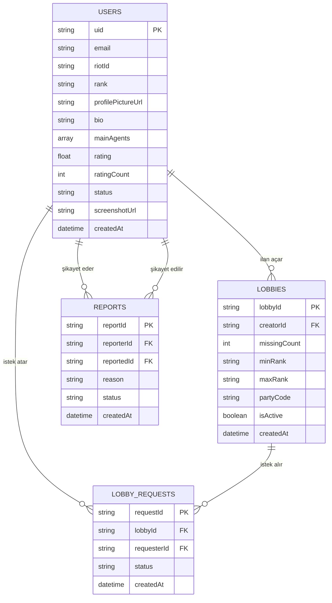

```mermaid
erDiagram
    USERS {
        string uid PK
        string email
        string riotId
        string rank
        string profilePictureUrl
        string bio
        array mainAgents
        float rating
        int ratingCount
        string status
        string screenshotUrl
        datetime createdAt
    }
    
    LOBBIES {
        string lobbyId PK
        string creatorId FK
        int missingCount
        string minRank
        string maxRank
        string partyCode
        boolean isActive
        datetime createdAt
    }
    
    LOBBY_REQUESTS {
        string requestId PK
        string lobbyId FK
        string requesterId FK
        string status
        datetime createdAt
    }
    
    REPORTS {
        string reportId PK
        string reporterId FK
        string reportedId FK
        string reason
        string status
        datetime createdAt
    }

    USERS ||--o{ LOBBIES : "ilan açar"
    USERS ||--o{ LOBBY_REQUESTS : "istek atar"
    LOBBIES ||--o{ LOBBY_REQUESTS : "istek alır"
    USERS ||--o{ REPORTS : "şikayet eder"
    USERS ||--o{ REPORTS : "şikayet edilir"
```
